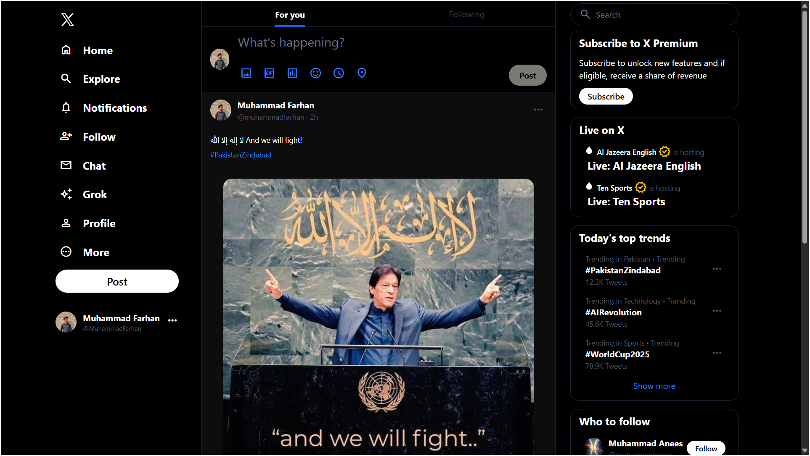
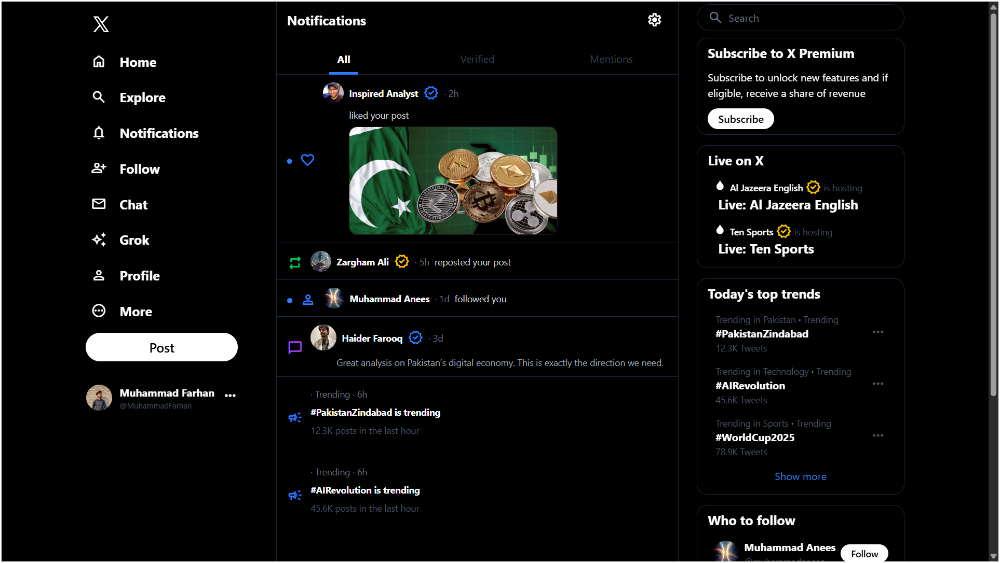
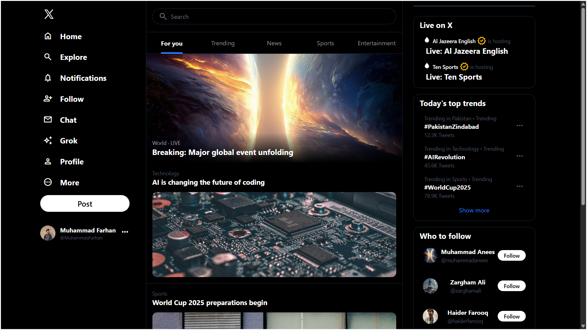
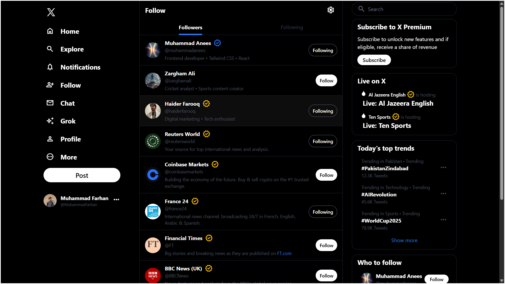
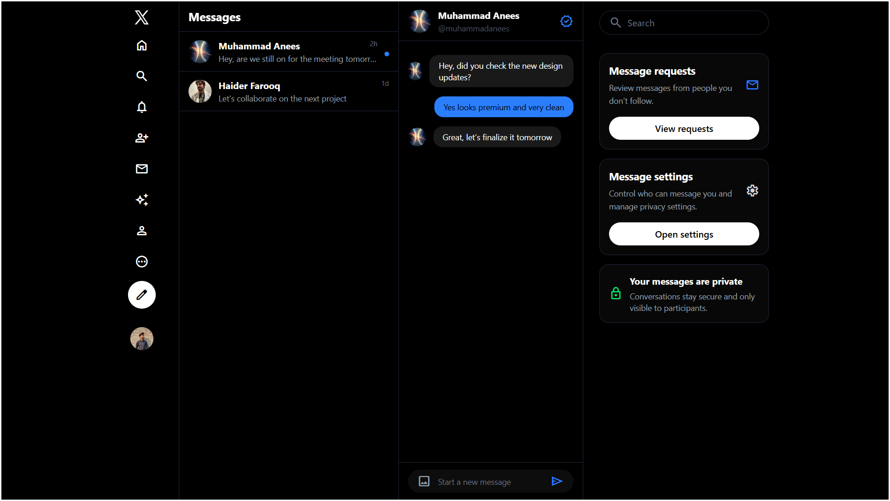
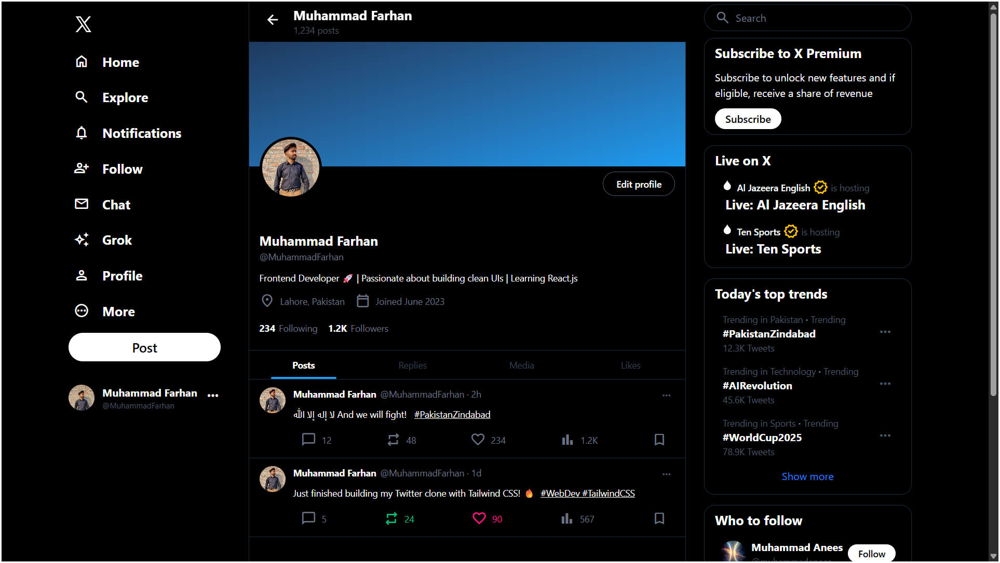

# X (Twitter) Clone Tailwind

A fully responsive X (Twitter) clone built with HTML, Tailwind CSS and JavaScript. This project recreates the core user interface of X (formerly Twitter), including navigation, feed layout, notifications, messaging interface and profile sections while maintaining a mobile-first responsive design.

## 🚀 Features
- Fully responsive layout
- Responsive sidebar and bottom navigation
- Dynamic active navigation states
- Home feed UI
- Explore page
- Notifications page
- Chat interface
- Follow suggestions page
- Profile page
- Responsive post cards
- Reusable utility and component classes
- Mobile, tablet, and desktop support 


## ⌨️ Tech Stack 

- HTML5
- Tailwind CSS
- Javascript (Vanilla JS)

## 📂 Folder Structure

```text
X (Twitter)/
│
├── assets/
│   └── images/
├── css/
│   ├── components.css
│   ├── input.css
│   └── output.css
├── js/
│   ├── bottomnav.js
│   ├── rightpanel.js
│   ├── script.js
│   └── sidebar.js
├── pages/
├── index.html
├── package.json
├── tailwind.config.js
└── .gitignore
```

## 🎯 Learning Outcomes
This project improved my understanding of:

- Responsive design
- Flexbox layouts
- Tailwind CSS utilities
- Reusable component architecture
- Frontend debugging
- Mobile-first development
- Dynamic UI rendering with JavaScript


## 📸 Screenshots

### Home Page


### Notifications


### Explore Feed


### Following List


### Chat Section


### Profile



## 🌐 Live Demo 
[View Live Demo](https://xclone-twitter.netlify.app/index.html)

## 👨‍💻 Author

**Muhammad Farhan**

Frontend Developer

GitHub: https://github.com/Fury85